# LCC-ICA: Locally Centered Cyclic Kernels for Higher-Order ICA

Experiment code for the paper:

> **Locally Centered Cyclic Kernels for Higher-Order Independent Component Analysis**  
> Tetsuya Saito  
> *TechRxiv*, 2026  
> https://doi.org/10.36227/techrxiv.XXXXXXX

The core LCC library is at [Kleinverse/icalcc](https://github.com/Kleinverse/icalcc).

---

## Repository Structure

```
lcc/
├── truncation.py     # IS divergence gap and LCC nondegeneracy
├── separation.py     # Synthetic ICA Amari index and Gamma(α) scan
├── are.py            # Asymptotic relative efficiency
├── img/              # Image separation results
│   ├── src_*.png     # Original textures
│   ├── mix_*.png     # Mixed images
│   ├── fica_*.png    # FastICA(4) separated
│   └── lcc_*.png     # LCC(6) separated
├── wav/              # Audio separation results
│   ├── src_*.wav     # Original stems
│   ├── mix_*.wav     # Mixed signals
│   ├── fica_*.wav    # FastICA(4) separated
│   └── lcc_*.wav     # LCC(6) separated
└── README.md
```

---

## Requirements

```bash
pip install numpy scipy
```

---

## Usage

```bash
# IS divergence gap and LCC nondegeneracy
python truncation.py

# Synthetic ICA separation quality
python separation.py --ho

# Gamma(α) scan
python separation.py --scan

# Test suite
python separation.py --test

# Asymptotic relative efficiency
python are.py
```

---

## Results

### IS Divergence Gap (θ = 0.5)

| Source | K(θ)/θ | [M(θ)−1]/θ | D_IS/θ |
|---|---|---|---|
| Uniform | 0.2440 | 0.2595 | 0.0155 |
| Laplace | 0.2671 | 0.2857 | 0.0187 |
| Exponential | 0.3863 | 0.4261 | 0.0399 |

### LCC Nondegeneracy (sample mean of V_k)

| Distribution | k=2 | k=4 | k=6 | k=8 |
|---|---|---|---|---|
| Uniform | −0.500 | 0.262 | −0.148 | 0.091 |
| Laplace | −0.500 | 0.141 | −0.074 | 0.043 |
| Exponential | −0.500 | 0.047 | −0.015 | 0.006 |

### Synthetic ICA — Mean Amari Index (×10⁻²)

|  | Laplace 100k | Logistic 100k | Uniform 100k | Student-t15 100k |
|---|---|---|---|---|
| FastICA(4) | 0.72 | 1.01 | 0.24 | 1.66 |
| FastICA(6) | 1.30 | 1.67 | 0.21 | 2.54 |
| FastICA(8) | 2.29 | 3.05 | 0.19 | 4.32 |
| LCC(4) | 0.63 | 1.17 | 0.24 | 1.69 |
| LCC(6) | **0.59** | **0.91** | 0.24 | 1.71 |
| LCC(8) | 0.96 | 0.92 | 0.24 | 1.65 |

### Asymptotic Relative Efficiency

| | Laplace | Logistic | Uniform |
|---|---|---|---|
| ARE(k=6) theory / empirical | 4.93 / 4.85 | 4.29 / 3.37 | 0.61 / 0.77 |
| ARE(k=8) theory / empirical | 9.22 / 5.69 | 44.16 / 10.99 | 0.44 / 0.63 |

### Image Separation

Four 512×512 grayscale textures from scikit-image [[2]](#references) mixed by a random 4×4 matrix.

| Source | m3 | m4 | FastICA(4) | LCC(6) |
|---|---|---|---|---|
| Cameraman | −0.47 | −1.31 | 0.9893 | **0.9925** |
| Moon | −1.74 | +29.57 | **0.9954** | 0.9751 |
| Brick | +1.69 | +1.61 | 0.9869 | **0.9995** |
| Gravel | −0.56 | −0.09 | **0.9999** | 0.9982 |
| **Amari (×10⁻²)** | | | 4.16 | 4.33 |

| | Cameraman | Moon | Brick | Gravel |
|---|---|---|---|---|
| Source |  | 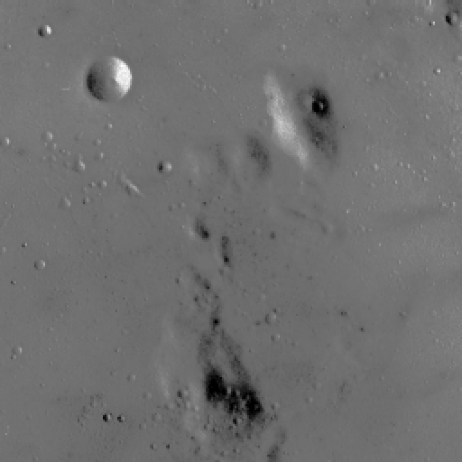 | 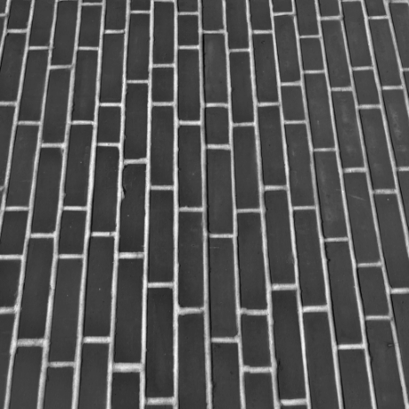 | 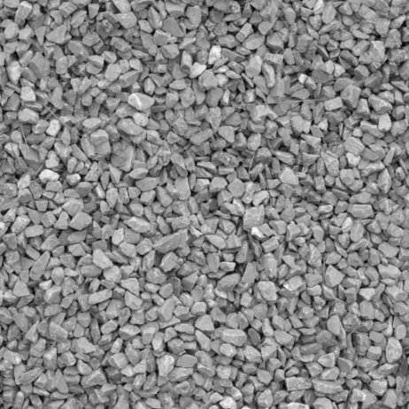 |
| Mix | 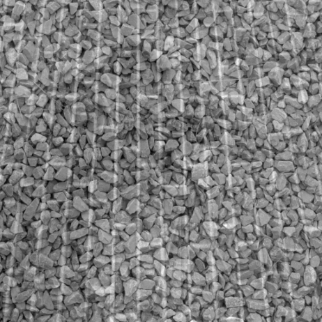 | 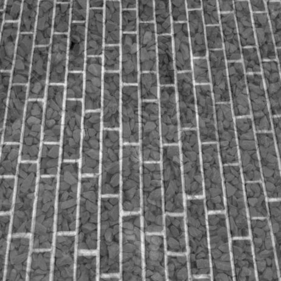 | 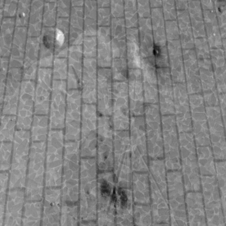 | 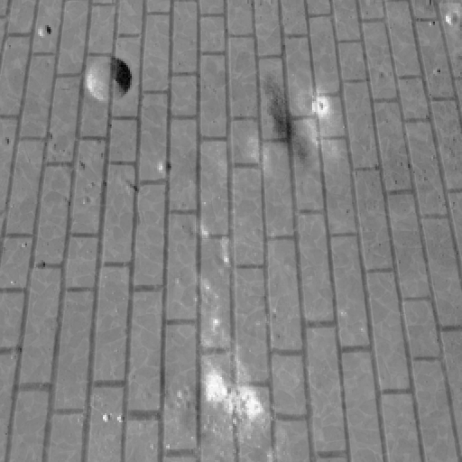 |
| FastICA(4) | 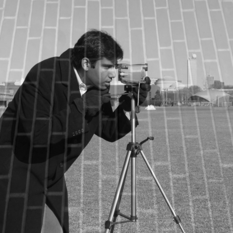 | 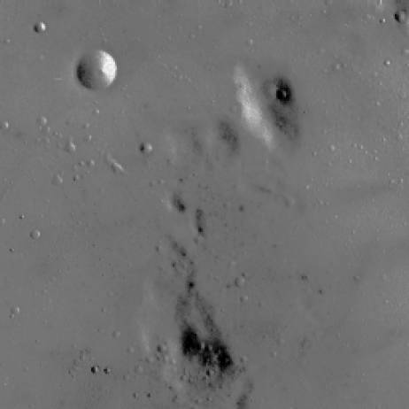 | 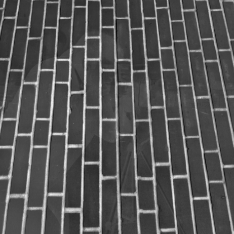 | 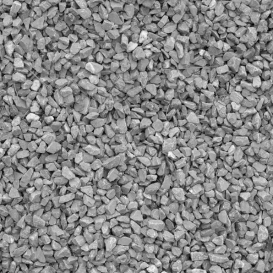 |
| LCC(6) | 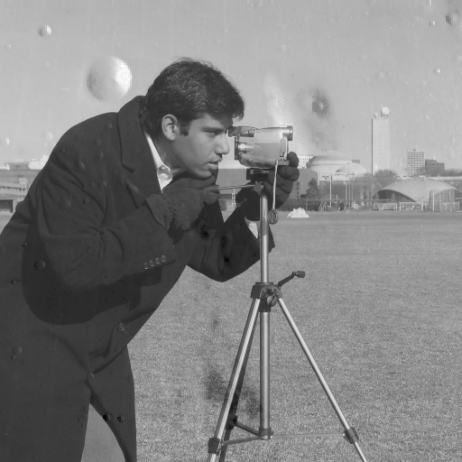 | 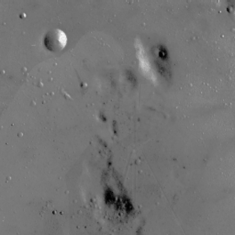 | 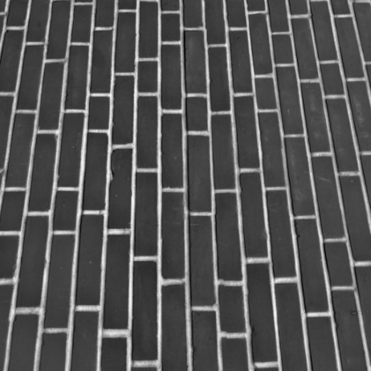 | 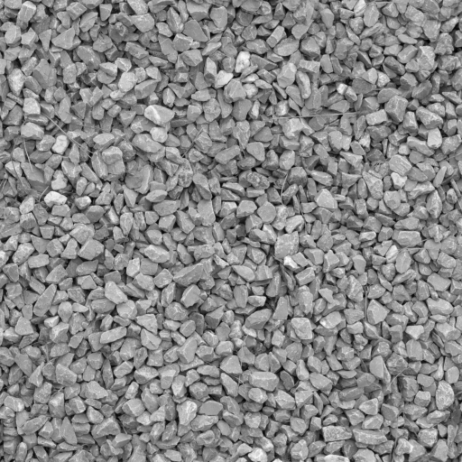 |

### Audio Separation — MUSDB18

The four stems (vocals, drums, bass, other) of a MUSDB18 [[3]](#references) track at 44.1 kHz.

| Stem | m3 | m4 | FastICA(4) | LCC(6) |
|---|---|---|---|---|
| Vocals | −0.32 | +1.64 | 0.9998 | **0.9999** |
| Drums | −0.09 | +11.52 | **0.9998** | 0.9989 |
| Bass | −0.21 | −0.35 | 0.9807 | **0.9994** |
| Other | −0.03 | +0.13 | 0.9814 | **0.9995** |
| **Amari (×10⁻²)** | | | 4.01 | **1.60** |

**Listen to separated audio:**

| Stem | Source | Mix | FastICA(4) | LCC(6) |
|---|---|---|---|---|
| Vocals | [src_1.wav](wav/src_1.wav) | [mix_1.wav](wav/mix_1.wav) | [fica_1_vocals.wav](wav/fica_1_vocals.wav) | [lcc_1_vocals.wav](wav/lcc_1_vocals.wav) |
| Drums | [src_2.wav](wav/src_2.wav) | [mix_2.wav](wav/mix_2.wav) | [fica_2_drums.wav](wav/fica_2_drums.wav) | [lcc_2_drums.wav](wav/lcc_2_drums.wav) |
| Bass | [src_3.wav](wav/src_3.wav) | [mix_3.wav](wav/mix_3.wav) | [fica_3_bass.wav](wav/fica_3_bass.wav) | [lcc_3_bass.wav](wav/lcc_3_bass.wav) |
| Other | [src_4.wav](wav/src_4.wav) | [mix_4.wav](wav/mix_4.wav) | [fica_4_other.wav](wav/fica_4_other.wav) | [lcc_4_other.wav](wav/lcc_4_other.wav) |

---

## Citation

```bibtex
@misc{saito2026lcc,
  author    = {Saito, Tetsuya},
  title     = {Locally Centered Cyclic Kernels for Higher-Order Independent Component Analysis},
  year      = {2026},
  publisher = {TechRxiv},
  doi       = {10.36227/techrxiv.XXXXXXX}
}
```

---

## References

[1] T. Saito, "Locally Centered Cyclic Kernels for Higher-Order Independent Component Analysis," *TechRxiv*, 2026. https://doi.org/10.36227/techrxiv.XXXXXXX

[2] S. van der Walt et al., "scikit-image: Image processing in Python," *PeerJ*, vol. 2, p. e453, 2014.

[3] Z. Rafii, A. Liutkus, F.-R. Stöter, S. I. Mimilakis, and R. Bittner, "The MUSDB18 corpus for music separation," 2017. https://doi.org/10.5281/zenodo.1117372

---

## License

MIT License. Copyright (c) 2026 Kleinverse AI, Inc.
